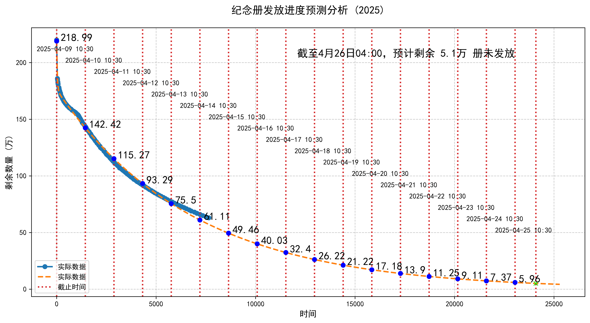

# 用于预测2025年《崩坏：星穹铁道》赠送纪念册

## 纪念册要求（6选5）：

1. 在2024年4月26日~2025年的4月26日中登录游戏超过340天。

2. 拥有不包含开拓者和未激活的星魂的5星角色和黑塔商店中的5星光锥数量达到70。

3. 开拓者等级达到60级。

4. 完成3.1版本的开拓任务【来路啊，请再度显映往履】。

5. 在3.2版本更新后，完成对应末日幻影、虚构叙事、回忆混沌的挑战。

6. 差分宇宙：千面英雄的拟合等级提升到25级。

### 数据来源：
壁吧专楼吧 https://zlb.ink/t/topic/20969 ，将数据打包在‘data.xlsx’文件中，以2025.04.09-10:30为0时间戳，用间隔时间创建时间戳，预测时间戳与剩余数量的关系。

#### 注：数据截止至2025.04.14-18:00

#### 模型：双指数模型

结果如下：

即：截止到2025.04.14-18:00时的数据，双指数模型预测到2025年4月26日04:00，预计剩余5.1万 册未发放。
